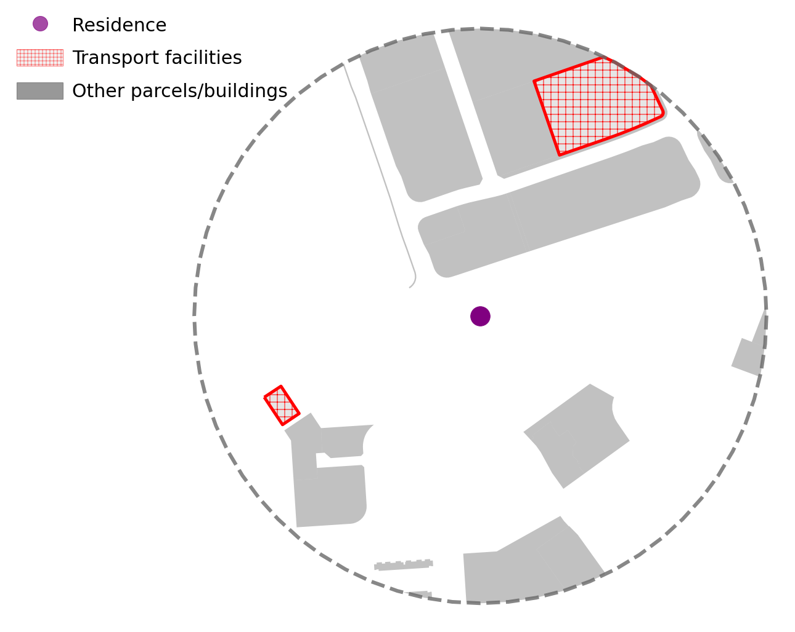
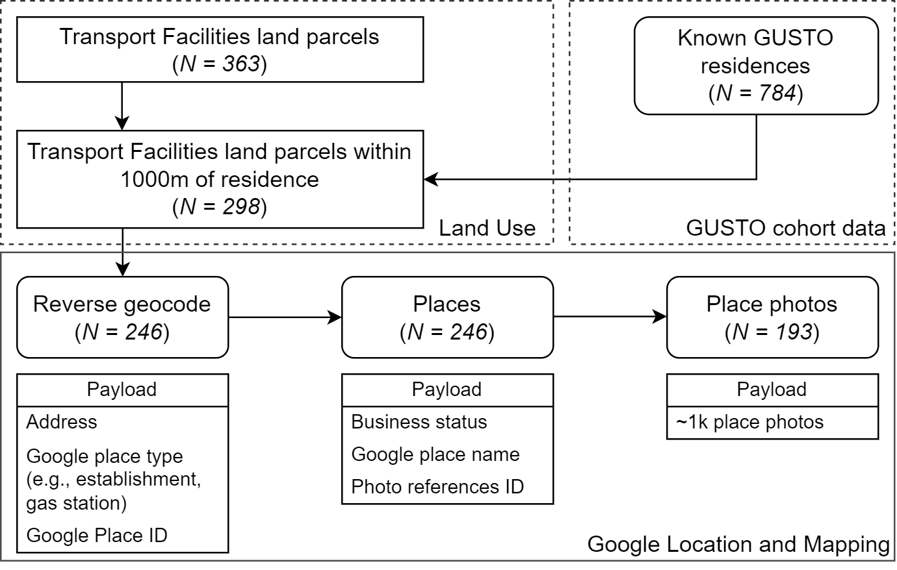

# Residential Proximity to Transport Facilities and PFAS Exposures

[](https://github.com/LSYS/tfpfas/actions/workflows/links.yml)
[](https://github.com/LSYS/tfpfas/actions/workflows/citations_watch.yml)

Code to replicate all key results, tables, and figures for "Residential proximity to transport facilities as urban determinants of individual-level per- and poly-fluoroalkyl substance (PFAS) exposures: Analysis of two longitudinal cohorts in Singapore".

## Summary

Linking PFAS concentrations in the blood plasma of pregnant women to a novel spatial dataset of urban land use in Singapore, we find that women living near transport facilities had higher concentrations of newer, unregulated, short-chained PFAS (PFBS, PFBA) and PFNA. 
Querying Google Photos for the gazetted, geo-tagged land use parcels reveals that most transport facilities are small petrol kiosks, while those with larger footprints driving the associations are transit depots. 
We replicate these spatial associations across different congeners in a younger cohort, and confirm that future residence (as a placebo exposure) reveals no such associations.
We discuss the implications of underappreciated urban sources given increasing urbanization, as well as airborne transmission from automotive products as a plausible exposure mechanism.




<details>
<summary><b>📋 Full Abstract</b></summary>

**Background:** Policy-relevant spatial determinants of human exposure to Perfluoroalkyl Substances (PFAS), a broad class of persistent environmental contaminants affecting pregnancy and child development, remain poorly understood because of the diversity of exposure sources. This is especially true for modern, dense urban settings, which contain less well-studied built environment-related sources, including transportation-related ground and airborne contamination.

**Methods:** We link high-resolution spatiotemporal urban land use data to longitudinal residential histories to assess determinants of individual-level blood plasma PFAS exposures in two geographically- and demographically- diverse cohorts of pregnant women in urban Singapore (n = 784 in 2009–2011; n = 384 in 2015–2017). Longitudinal repeated measures allow us to rule out socio-behavioral factors (e.g., residential segregation) as alternative explanations. Actual land use occupancies were ground-truthed through automated extraction of Google Street View data.

**Findings:** Adjusting for known predictors and within-neighborhood unobserved spatial heterogeneity, a standard deviation (SD) increase (~10,000m²) in transport facility exposure was linked to 0.11 (1.78 ng/mL), 0.16, 0.11 SD increases in residents' perfluorobutane sulfonic acid (PFBS), perfluorobutanoic acid (PFBA), and perfluorononanoic acid (PFNA) concentrations, respectively, in the 2009 cohort. Dose-response analyses suggested that associations strengthened when transport facilities exceeded 10,000 m², with residents living near ≥12,000 m² exhibiting 7.3 ng/mL higher plasma PFBS (p = 0.04), consistent with footprints from large bus depots rather than smaller petrol kiosks. Associations with different PFAS congeners were replicated in the 2015 cohort. No other land use type showed similarly consistent findings.

**Interpretations:** Transport facilities are prevalent near residences in urban settings and may be potential sources of PFAS emissions from automotive-related lubricants, parts, and materials. Our findings that exposure was robustly associated with individual-level concentration, over and above behavioral and other factors, highlight the importance of monitoring these and other urban sources of exposure.

</details>

## 📁 Repository Structure

```bash
.
├── .github/
│  └── workflows
├── ado/
├── analyses/
├── assets/
├── data/
├── figures/
├── logs/
├── places/
├── tables/
├── paperpile.bib
├── README.md
├── references.bib
└── tfpfas.do
```

<details>
<summary><b>Complete file tree/manifest</b></summary>
  
```bash
.
├── .github
│  └── workflows
├── ado
│  ├── assert_macros.ado
│  ├── bcplot_thresholds.ado
│  ├── beepme.ado
│  ├── my_binscatterhist.ado
│  ├── runregs.ado
│  ├── runregs_future.ado
│  ├── savefig.ado
│  ├── storespecs.ado
│  └── tictoc.ado
├── analyses
│  ├── binscatter.do
│  ├── coefplot-threshold-dose-response.do
│  ├── correlates-pfbs-pfas.do
│  ├── dfbetas.do
│  ├── env-covariates-coefplot.do
│  ├── forestplot-spresto.ipynb
│  ├── forestplot.ipynb
│  ├── movers-future-exposure.do
│  ├── negatives-spatial-instruments.do
│  ├── other-LU.do
│  ├── preamble.do
│  ├── spresto.do
│  ├── standardized-estimates.do
│  └── tabulate-estimates.do
├── assets
│  ├── gm-places-pipeline-250dpi.png
│  ├── gm-places-pipeline.drawio.xml
│  ├── requirements-stata.txt
│  └── requirements.txt
├── data
│  ├── .gitkeep
│  ├── coefplot-pfas-transport-facilities-model5-cordblood.csv
│  ├── coefplot-pfas-transport-facilities-spresto.csv
│  ├── edc-gusto-completeness-tabulation.csv
│  ├── edc-lod-loq.csv
│  ├── pfas-plasma-spresto-completeness-tabulation.csv
│  ├── pfas-tf-model5-cordblood.dta
│  └── pfas-tf-spresto.dta
├── figures
│  ├── coefplot-8pfas-transport-facilities-model5-cordblood.pdf
│  ├── coefplot-8pfas-transport-facilities-model5-cordblood.png
│  ├── coefplot-8pfas-transport-facilities-spresto.pdf
│  ├── coefplot-8pfas-transport-facilities-spresto.png
│  ├── coefplot-correlates-of-pfbs-cordblood.eps
│  ├── coefplot-correlates-of-pfbs-cordblood.pdf
│  ├── coefplot-correlates-of-pfbs-cordblood.png
│  ├── coefplot-correlates-of-tf500m-sorted.eps
│  ├── coefplot-correlates-of-tf500m-sorted.pdf
│  ├── coefplot-correlates-of-tf500m-sorted.png
│  ├── coefplot-pfba-binary-cutoff.eps
│  ├── coefplot-pfba-binary-cutoff.pdf
│  ├── coefplot-pfba-binary-cutoff.png
│  ├── coefplot-pfbs-binary-cutoff.eps
│  ├── coefplot-pfbs-binary-cutoff.pdf
│  ├── coefplot-pfbs-binary-cutoff.png
│  ├── coefplot-pfbs-lu-association.eps
│  ├── coefplot-pfbs-lu-association.pdf
│  ├── coefplot-pfbs-lu-association.png
│  ├── coefplot-pfda-binary-cutoff.eps
│  ├── coefplot-pfda-binary-cutoff.pdf
│  ├── coefplot-pfda-binary-cutoff.png
│  ├── coefplot-pfhxs-binary-cutoff.eps
│  ├── coefplot-pfhxs-binary-cutoff.pdf
│  ├── coefplot-pfhxs-binary-cutoff.png
│  ├── coefplot-pfna-binary-cutoff.eps
│  ├── coefplot-pfna-binary-cutoff.pdf
│  ├── coefplot-pfna-binary-cutoff.png
│  ├── coefplot-pfoa-binary-cutoff.eps
│  ├── coefplot-pfoa-binary-cutoff.pdf
│  ├── coefplot-pfoa-binary-cutoff.png
│  ├── coefplot-pfos-binary-cutoff.eps
│  ├── coefplot-pfos-binary-cutoff.pdf
│  ├── coefplot-pfos-binary-cutoff.png
│  ├── coefplot-pfunda-binary-cutoff.eps
│  ├── coefplot-pfunda-binary-cutoff.pdf
│  ├── coefplot-pfunda-binary-cutoff.png
│  ├── coefplot-unstandardized-pfbs-binary-cutoff-buff500m_transport_facilities.eps
│  ├── coefplot-unstandardized-pfbs-binary-cutoff-buff500m_transport_facilities.pdf
│  ├── coefplot-unstandardized-pfbs-binary-cutoff-buff500m_transport_facilities.png
│  ├── dfbetas-pfbs-buff500m-transportfacilities.eps
│  ├── dfbetas-pfbs-buff500m-transportfacilities.pdf
│  ├── dfbetas-pfbs-buff500m-transportfacilities.png
│  ├── dfbetas-planningarea-pfbs-buff500m-transportfacilities.eps
│  ├── dfbetas-planningarea-pfbs-buff500m-transportfacilities.pdf
│  ├── dfbetas-planningarea-pfbs-buff500m-transportfacilities.png
│  ├── dfbetas-subzones-pfbs-buff500m-transportfacilities.eps
│  ├── dfbetas-subzones-pfbs-buff500m-transportfacilities.pdf
│  ├── dfbetas-subzones-pfbs-buff500m-transportfacilities.png
│  ├── env-covariates-coefplot.eps
│  ├── env-covariates-coefplot.pdf
│  ├── env-covariates-coefplot.png
│  ├── scatter-pfbs-buff100m_area_transport_faciliti.pdf
│  ├── scatter-pfbs-buff500m_area_transport_faciliti.pdf
│  ├── scatter-pfbs-buff1000m_area_transport_facilit.pdf
│  └── scatter-pfbs-buff1500m_area_transport_facilit.pdf
├── logs
│  ├── tf-pfas-spresto.log
│  ├── tf-pfas-spresto.pdf
│  ├── tf-pfas-spresto.smcl
│  ├── tf-pfas.log
│  ├── tf-pfas.pdf
│  └── tf-pfas.smcl
├── places
│  ├── 1-geocoding-within1000m-residence.py
│  ├── 2-geocoding-rgeocode.py
│  ├── 3-geocoding-consolidate-rgeocode-payload.py
│  ├── 4-geocoding-places.py
│  ├── 5-geocoding-consolidate-places.py
│  ├── 6-geocoding-selected-placepictures.py
│  └── readme.md
├── tables
│  ├── pfbs-100m-transportfacilities-fragment.tex
│  ├── pfbs-500m-transportfacilities-fragment.tex
│  ├── pfbs-500m-transportfacilities-movedaddress-fragment.tex
│  ├── pfbs-500m-transportfacilities-moversonly-fragment.tex
│  ├── pfbs-1000m-transportfacilities-fragment.tex
│  ├── pfbs-1500m-transportfacilities-fragment.tex
│  ├── pfbs-buff500m_count_transport_facilit-fragment.tex
│  ├── pfbs-transport_facilities_dist_pc2cen-fragment.tex
│  ├── pfbs-transport_facilities_dist_pc2edg-fragment.tex
│  ├── pfbs-tt10min_area_transport_facilitie-fragment.tex
│  ├── pfbs-tt15min_area_transport_facilitie-fragment.tex
│  └── pfbs-tt20min_area_transport_facilitie-fragment.tex
├── .gitignore
├── CITATION.cff
├── LICENSE
├── paperpile.bib
├── README.md
├── references.bib
└── tfpfas.do
```
</details>


## 🛠️ Software Requirements

The statistical analyses are implemented in Stata code (tested on version 13 and 16).
The spatial data construction and the geocoding pipeline is implemented in Python, with requirements including the Google Maps APIs.
Please see [`./assets/requirements-stata.txt`](./assets/requirements-stata.txt) and [`./assets/requirements.txt`](./assets/requirements.txt) for the specific required packages and [`./ado/`](./ado/) for the required custom Stata programs.


## Analyses

The master file `tfpfas.do` executes the entire analysis pipeline:
```stata
do tfpfas
```

This loads the data, runs all statistical analyses, generates tables and figures, and performs robustness checks.
The master file calls all other analysis scripts in sequence, generates tables to [`./tables/`](./tables/) and figures to [`./figures/`](./figures/), and logs all output to `./logs/tf-pfas.log`.


## Results

Code-generated results are in:
- **Figures:** `./figures/` (`.png`, `.pdf`, `.eps`)
- **Tables:** `./tables/` (`.tex`)
- **Logs:** `./logs/` (`.pdf`, `txt`, `.smcl`)


## 🗺️ Places

This workflow identifies transport facilities within 1000m of study participant residences using Singapore's 2008 land use data.
The pipeline uses Google Maps APIs (reverse geocoding, Places, and Photos) to characterize facility types, compute spatial metrics (area, distance), and retrieve public-contributed street-level site photos of transport facilities for manual verification. 



## Acknowledgements

This research would not have been possible without the work of GUSTO and S-PRESTO particpants, research coordinators, staff, and investigators.


## License

This code is released under the [MIT License](./LICENSE).

## 📚 Citation


